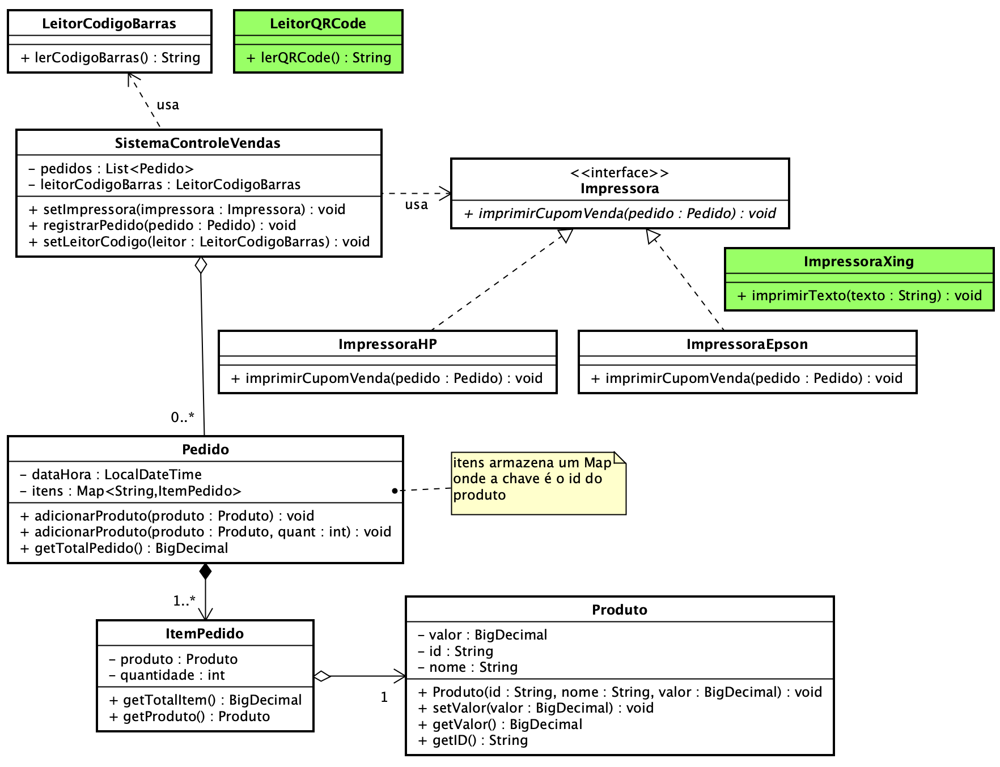
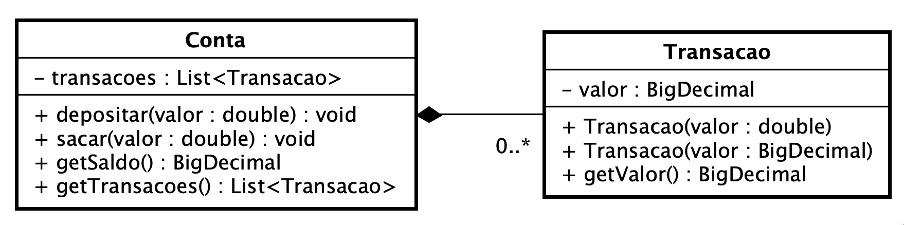

**Universidade Federal da Paraíba - UFPB** \
**Centro de Ciências Exatas e Educação - CCAE** \
**Departamento de Ciências Exatas - DCX**

**Professor:** [Rodrigo Rebouças de Almeida](http://rodrigor.dcx.ufpb.br)

# Avaliação 2

<!-- Atenção! Depois de digitar seu nome, por favor faça commit e push no repositório -->

*Seu nome:* Digite seu nome aqui

# Controle de Vendas e Impressoras

O diagrama abaixo representa algumas entidades de um sistema de controle de vendas

## Questão 1
Implemente uma nova classe `ImpressoraXing`, que implementa a interface `Impressora`;

_Obs: o teste `ImpressoraXingTest` deve passar_ 

## Questão 2
O sistema de controle de vendas usa um leitor de código de barras `LeitoCodigoBarras`,
só que a empresa precisa usar também um leitor de QRCode `LeitorQRCode`. O problema é 
que o `SistemaControleVendas` está acoplado com a classe `LeitorCodigoBarras`.

Quebre o acoplamento entre as duas classes e permita que o `SistemaControleVendas` aceite
o `LeitorQRCode`.

Os testes `LeitorCodigoBarrasTest` e `LeitorQRCodeTest` devem passar.

## Questão 3
Implemente testes para a classe `Transacao`

## Questão 4
As classes `Conta` e `Transacao` estão implementadas, mas seus testes não estão passando.
Faça as mudanças nas classes para que os testes passem.

